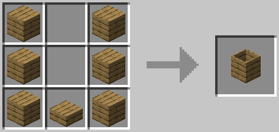
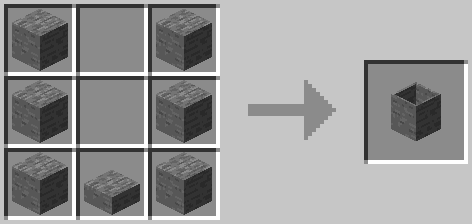

Barrel
======
The barrel has a wide range of uses. You can use it to compost organics into dirt, transform one fluid into another, transform a fluid into a block with an item, and spawn mobs. When in the rain, the barrel will collect water. Right click the barrel to get a block out of the barrel. Right click the barrel with a bucket to add or remove a fluid.

Wood barrels cannot accept hot fluids. Stone barrels can accept hot fluids. Water has a temperature of 300. Anything over 433 will not go into a wood barrel.

!!! Warning
    Once a compost item is in the barrel, it cannot be removed. A barrel will void any fluid in it when it is broken.
    
Recipe
------

---
- 6x Wood Plank (Any)
- 1x Wood Slab (Any)
---

---
- 6x Stone
- 1x Stone Stab
---
Fluid Transformation
--------------------
The following are the fluids that will transform. A full barrel and the correct block placed below the barrel is required for the transformation to occur.

| Fluid | Block    | Result     |
|-------|----------|------------|
| Water | Mycelium | Witchwater |
| Water | Sand     | Sea Water  |

Fluid Block Transformation
--------------------------
The following are the recipes that a barrel will perform when a block, or an item is right clicked on a full barrel with the correct fluid.

| Fluid      | Block or Item      | Result           |
|------------|--------------------|------------------|
| Water      | Dust               | Clay             |
| Lava       | Redstone Dust      | Netherrack       |
| Lava       | Glowstone Dust     | End Stone        |
| Witchwater | Sand               | Soul Sand        |
| Witchwater | Red Mushroom       | Slime            |
| Witchwater | Brown Mushroom     | Slime            |
| Sea Water  | Tube Coral Seed    | Tube Coral Block |
| Sea Water  | Brain Coral Seed   | Brain Coral Block |
| Sea Water  | Bubble Coral Seed  | Bubble Coral Block |
| Sea Water  | Horn Coral Seed    | Horn Coral Block |
| Sea Water  | Fire Coral Seed    | Fire Coral Block |
| Sea Water  | Tube Coral Fan     | Tube Coral Wall Fan |
| Sea Water  | Brain Coral Fan    | Brain Coral Wall Fan |
| Sea Water  | Bubble Coral Fan   | Bubble Coral Wall Fan |
| Sea Water  | Horn Coral Fan     | Horn Coral Wall Fan |
| Sea Water  | Fire Coral Fan     | Fire Coral Wall Fan |

Fluid On Top
------------
The following are the recipes that a barrel will perform when a barrel contains a fluid and another fluid is placed on top.

| Fluid In Barrel | Fluid On Top | Result      |
|-----------------|--------------|-------------|
| Lava            | Water        | Obsidian    |
| Water           | Lava         | Cobblestone |

Mob Spawning
------------
In order to spawn a mob, create the doll of the mob you want to spawn and right click a barrel that has the correct fluid in it.

| Mob      | Doll            | Fluid      |
|----------|-----------------|------------|
| Blaze    | Blazing Doll    | Lava       |
| Enderman | Creeping Doll   | Witchwater |
| Shulker  | Floating Doll   | Witchwater |
| Guardian | Protecting Doll | Water      |
| Bee      | Buzzing Doll    | Witchwater |

Compostable Blocks and Items
----------------------------
The following are items and blocks that can be composted and their amounts. A barrel begins composting when a barrel reaches a solid amount of 1000.

| Item              | Amount |
|:------------------|:------:|
| All Saplings      | 125    |
| All Leaves        | 125    |
| All Flowers       | 100    |
| All Fish          | 150    |
| All Cooked Meat   | 200    |
| All Uncooked Meat | 200    |
| All Seeds         | 80     |
| Wheat             | 80     |
| Carrot            | 100    |
| Beetroot          | 100    |
| Potato            | 100    |
| Nether Wart       | 100    |
| Eggs              | 80     |
| String            | 40     |
| Rotten Flesh      | 100    |
| Spider Eye        | 80     |
| Bread             | 160    |
| Mushrooms         | 100    |
| Pumpkin Pie       | 160    |
| Silkworm          | 40     |
| Cooked Silkworm   | 40     |
| Apple             | 100    |
| Mellon Slice      | 40     |
| Mellon            | 167    |
| Pumpkin           | 167    |
| Carved Pumpkin    | 167    |
| Jack-O-Lantern    | 167    |
| Cactus            | 100    |
| Baked Potato      | 150    |
| Poisonous Potato  | 200    |
| Lily Pad          | 100    |
| Vine              | 100    |
| Tall Grass        | 100    |
| Sugar Cane        | 80     |

Configuration
-------------
### Fluid Transformation Configuration
Configuration for Fluid Transformations are found in `~/config/exnihilosequentia/FluidTransformRegistry.json`.

The format of the file is: 
```
[
  {
    "fluidInBarrel: "modid:name",
    "blockBelow: "modid:name",
    "result: "modid:name"
  },
  ...
]
```
- `modid`: The mod id the block/item/fluid comes from (i.e. `exnihilosequentia`)
- `name`: The name of block/item/fluid (i.e. `witchwater`)

- `fluidInBarrel`: The fluid in the barrel to start the transformation (Must be a fluid or a tag). Required field.
- `blockBelow`: The block below the barrel to start the transformation (Must be a block or a tag). Required field.
- `result`: The fluid remaining after the transformation (Must be a fluid). Required field.

You may chain together as many:
```
{
  "fluidInBarrel: "modid:name",
  "blockBelow: "modid:name",
  "result: "modid:name"
}
```
blocks as you'd like as long as they are separated by commas and all of them remain inside `[ ]`.
!!! Important
    Duplicate recipes are not allowed. The first recipe in the list will be the one used.

### Fluid Block Transformation Configuration
Configuration for Fluid Block Transformations are found in `~/config/exnihilosequentia/FluidBlockTransformRegistry.json`.

The format of the file is: 
```
[
  {
    "fluid: "modid:name",
    "input: "modid:name",
    "result: "modid:name"
  },
  ...
]
```
- `modid`: The mod id the block/item/fluid comes from (i.e. `exnihilosequentia`)
- `name`: The name of block/item/fluid (i.e. `witchwater`)

- `fluid`: The fluid in the barrel (Must be a fluid or a tag). Required field.
- `input`: The input item/block (Must be an item, block or a tag). Required field.
- `result`: The resulting block (Must be a block). Required field.

You may chain together as many:
```
{
  "fluid: "modid:name",
  "input: "modid:name",
  "result: "modid:name"
}
```
blocks as you'd like as long as they are separated by commas and all of them remain inside `[ ]`.
!!! Important
    Duplicate recipes are not allowed. The first recipe in the list will be the one used.

### Fluid On Top Configuration
Configuration for Fluid On Top Recipes are found in `~/config/exnihilosequentia/FluidOnTopRegistry.json`.

The format of the file is: 
```
[
  {
    "fluidInBarrel: "modid:name",
    "fluidOnTop: "modid:name",
    "result: "modid:name"
  },
  ...
]
```
- `modid`: The mod id the block/item/fluid comes from (i.e. `exnihilosequentia`)
- `name`: The name of block/item/fluid (i.e. `witchwater`)

- `fluidInBarrel`: The fluid in the barrel (Must be a fluid or a tag). Required field.
- `fluidOnTop`: The fluid placed on top of the barrel (Must be a fluid or a tag). Required field.
- `result`: The resulting block (Must be a block). Required field.

You may chain together as many:
```
{
  "fluidInBarrel: "modid:name",
  "fluidOnTop: "modid:name",
  "result: "modid:name"
}
```
blocks as you'd like as long as they are separated by commas and all of them remain inside `[ ]`.
!!! Important
    Duplicate recipes are not allowed. The first recipe in the list will be the one used.

### Compost Amount Configuration
Configuration for Compost Amounts are found in `~/config/exnihilosequentia/CompostRegistry.json`.

The format of the file is: 
```
[
  {
    "entry: "modid:name",
    "amount: 0 < number
  },
  ...
]
```
- `modid`: The mod id the block/item/fluid comes from (i.e. `exnihilosequentia`)
- `name`: The name of block/item/fluid (i.e. `witchwater`)

- `entry`: The item or block that can be placed in a barrel (Must be an item, fluid or a tag). Required field.
- `amount`: The solid amount the entry will add to a barrel (Must be an integer greater than 0). Required field.

You may chain together as many:
```
{
    "entry: "modid:name",
    "amount: integer
  }
```
blocks as you'd like as long as they are separated by commas and all of them remain inside `[ ]`.
!!! Important
    Duplicate recipes are not allowed. The first recipe in the list will be the one used.