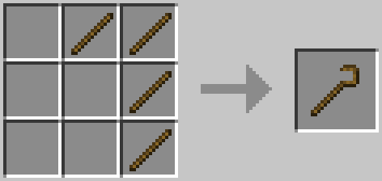
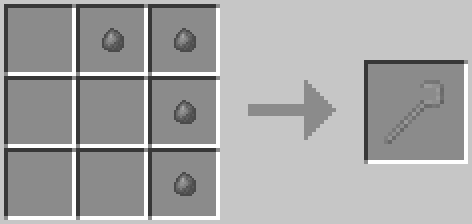
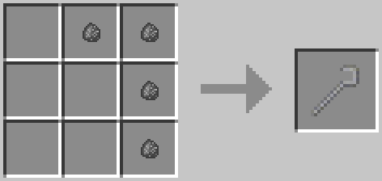
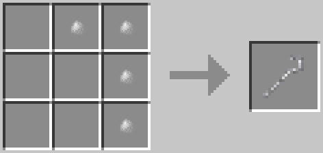
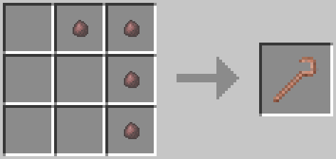
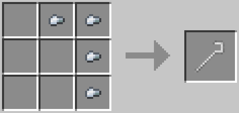
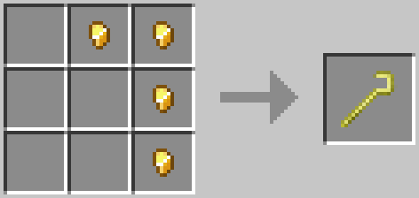
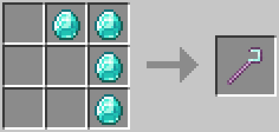

Crooks
======
Crooks are used to obtain resources from leaves. Silkworms can be obtained by breaking leaves with crooks. The only difference between crooks is their durability.

Recipes
-------
### Wooden Crook

### Stone Crook

### Andesite Crook

### Diorite Crook

### Granite Crook

### Iron Crook

### Gold Crook

### Diamond Crook

### Bone Crook
