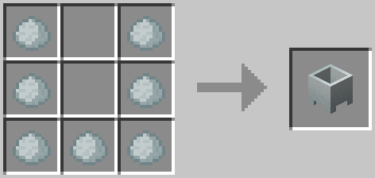
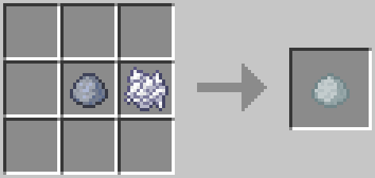

Crucible
========
The crucible is used to melt various blocks and items into fluids. Right click the barrel to place an item or block into the crucible. Place a heat source under the barrel to begin the melting process. Once a crucible is full, right click with a bucket to add or remove a fluid.

!!! Note
    An Unfired Crucible *MUST* be smelted to be used.

!!! Warning
    Once an item is in the crucible, it cannot be removed. A crucible will void any fluid in it when it is broken.

Recipe
------
### Wooden Crucible

---
- 4x Wood Log (Any)
- 1x Wood Slab (Any)
- 2x Stick

### Unfired Crucible

---
- 7x Porcelain Clay (Any)
- Smelt an Unfired Crucible to obtain a Fired Crucible.

### Porcelain Clay

---
- 1x Bone Meal
- 1x Clay

Wooden Crucible Meltable Items
------------------------------
Items in the following list will melt down into water in the wooden crucible.

| Item         | Amount |
|--------------|:------:|
| All Saplings | 250    |
| All Leaves   | 250    |

Fired Crucible Meltable Items
-----------------------------
Items in the following list will melt down into lava in the fired crucible.

| Item         | Amount |
|--------------|:------:|
| Cobblestone  | 250    |
| Diorite      | 250    |
| Andesite     | 250    |
| Granite      | 250    |
| Stone        | 250    |
| Gravel       | 200    |
| Sand         | 100    |
| Dust         | 50     |
| Netherrack   | 1000   |
| Obsidian     | 1000   |

Heat Sources
------------
The following blocks and fluids can be placed below a crucible to begin the melting process. Their heat amounts determine how quickly they melt items.

| Source      | Heat Rate |
|-------------|:---------:|
| Lava        | 3         |
| Fire        | 4         |
| Torch       | 1         |
| Magma Block | 2         |
| Glowstone   | 2         |