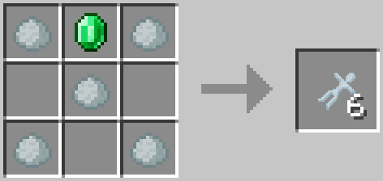
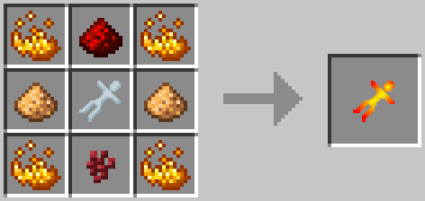
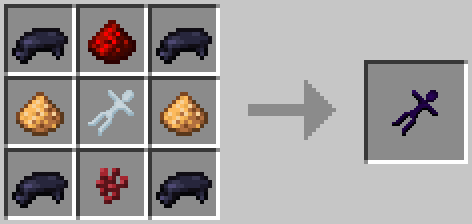
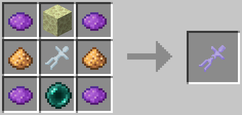
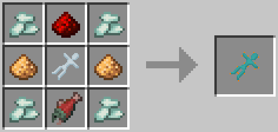

Dolls
=====
Dolls are used to spawn mobs in a barrel. To spawn a mob craft the doll for the entity you want to spawn and then right click on a barrel with the right fluid in it to spawn (See [Barrel Mob Spawning])

Recipes
-------
### Porcelain Doll

---
- 5x Porcelain Clay
- 1x Diamond

---
- 5x Porcelain Clay
- 1x Emerald

### Blazing Doll
Will spawn a Blaze

---
- 4x Blaze Powder
- 1x Redstone
- 1x Porcelain Doll
- 1x Nether Wart
- 2x Glowstone Dust

### Creeping Doll
Will spawn an Enderman

---
- 4x Black Dye
- 1x Redstone
- 1x Porcelain Doll
- 1x Nether Wart
- 2x Glowstone Dust

### Floating Doll
Will spawn a Shulker

---
- 4x Purple Dye
- 1x End Stone
- 1x Porcelain Doll
- 1x Ender Pearl
- 2x Glowstone Dust

### Protecting Doll
Will spawn a Guardian

--
- 4x Prismarine Crystal
- 1x Redstone
- 1x Porcelain Doll
- 1x Fish
- 2x Glowstone Dust

[Barrel Mob Spawning]: barrel.md/#mob-spawning