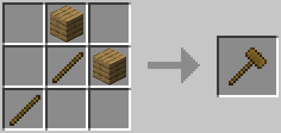
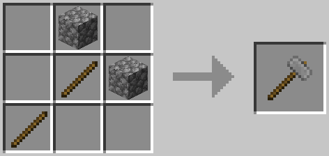
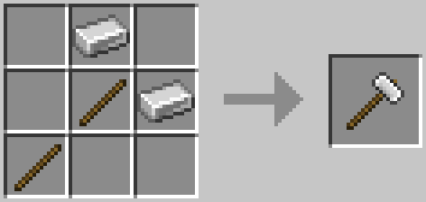
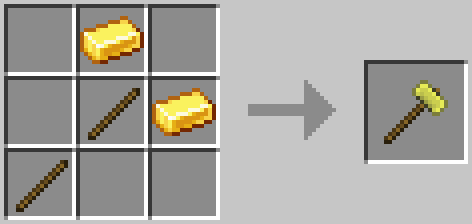
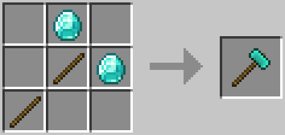

Hammers
=======
Hammers are used to break blocks down into other blocks. The only difference between hammers is their durability.

Recipes
-------
### Wooden Hammer


### Stone Hammer


### Iron Hammer


### Gold Hammer


### Diamond Hammer


Block Breakdown
---------------
The following is what a block will break down into.
| Original    | Output             |
|-------------|--------------------|
| Stone       | Cobblestone        |
| Cobblestone | Gravel             |
| Andesite    | Crushed Andesite   |
| Granite     | Crushed Granite    |
| Diorite     | Crushed Diorite    |
| Gravel      | Sand               |
| Sand        | Dust               |
| End Stone   | Crushed End Stone  |
| Netherrack  | Crushed Netherrack |
| Tube Coral Block | Tube Coral |
| Brain Coral Block | Brain Coral |
| Bubble Coral Block | Bubble Coral |
| Horn Coral Block | Horn Coral |
| Fire Coral Block | Fire Coral |
| Tube Coral | Tube Coral Fan |
| Brain Coral | Brain Coral Fan |
| Bubble Coral | Bubble Coral Fan |
| Horn Coral | Horn Coral Fan |
| Fire Coral | Fire Coral Fan |

Configuration
-------------
Configuration for Hammerable Blocks are found in `~/config/exnihilosequentia/HammerRegistry.json`.

The format of the file is: 
```
[
  {
    "input: "modid:name",
    "output: "modid:name"
  },
  ...
]
```
- `modid`: The mod id the block/item/fluid comes from (i.e. `exnihilosequentia`)
- `name`: The name of block/item/fluid (i.e. `witchwater`)

- `input`: The block broken by the hammer (Must be a block). Required field.
- `output`: The block the input turns into (Must be a block). Required field.


You may chain together as many:
```
{
  "input: "modid:name",
  "output: "modid:name",
}
```
blocks as you'd like as long as they are separated by commas and all of them remain inside `[ ]`.
!!! Important
    Duplicate recipes are not allowed. The first recipe in the list will be the one used.