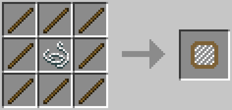

Miscellaneous
=====================
Silkworms
---------
Silkworms can be obtained by breaking leaves with a crook or by sifting leaves. Right clicking a slikworm onto leaves will infest it and after some time the leaf block will become completely infested. Breaking an Infested Leaves block (Not Infesting Leaves) will result in string being dropped. Infested leaves will spread to other leaves around it.

Silkworms can also be cooked into an edible form.

Recipes
=======
Various recipes that don't really fall under a category.

## Andesite

## Cobblestone

## Diorite

## Granite

## Iron Ore Chunk

## Gold Ore Chunk

## End Cake

## Beehive Frame

## Beehive
