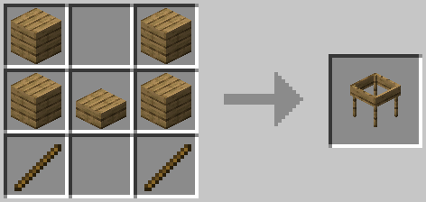
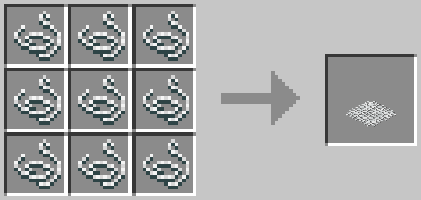
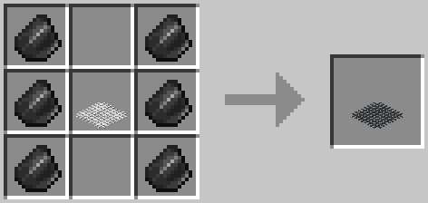
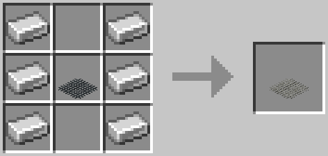
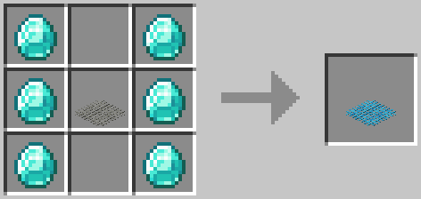

Sieve
=====
The sieve is how you get most of your resources. Pretty much everything can be obtained by sifting a block in the sieve. You will need to place a mesh in the sieve before you can use it. To place a block in the sieve, simply right click the sieve with the block that you want to sift. Continue right clicking until the block is gone to obtain your resources.

Multi-sieve sifting can be accomplished by placing other sieves nearby on the same Y level. A sieve that is activated will attempt to use other sieves in a configurable radius.

!!! Warning
    Once a block is partially sieved it is stuck in the sieve until you finish sifting.

Recipe
-----

---
- 4x Wood Plank (Any)
- 1x Wood Slab (Any)
- 2x Stick

Meshes
------
Meshes are used to obtain resources from the sieve. Different meshes have different drop chances. General rule of thumb is the more it costs to make a mesh, the better chances to drop resources.

## String Mesh

## Flint Mesh

## Iron Mesh

## Diamond Mesh

Results
-------
The following is a list of the possible drops from the sieve. Listed is the block that it comes from, the mesh required to obtain it(unless the mesh recipes have been flattened), and if the sieve must be placed in water. 
!!! Note
    Multiple "Results" entries means that an item can drop more than once with the respective percentage. (i.e. The Stone Pebble has a drop rate of 2 pebbles 100% of the time with a chance of a third and fourth pebble 50% of the time and a fifth and sixth pebble 10% of the time.)

| Block              | Results           | Percents     | Mesh Required | Waterlogged |
|:-------------------|:------------------|:------------:|:-------------:|:-----------:|
| Dirt               | Stone Pebble      | 100 %        | String        | false       |
|                    |                   | 100 %        | String        | false       |
|                    |                   | 50 %         | String        | false       |
|                    |                   | 50 %         | String        | false       |
|                    |                   | 10 %         | String        | false       |
|                    |                   | 10 %         | String        | false       |
|                    | Andesite Pebble   | 50 %         | String        | false       |
|                    |                   | 10 %         | String        | false       |
|                    | Diorite Pebble    | 50 %         | String        | false       |
|                    |                   | 10 %         | String        | false       |
|                    | Granite Pebble    | 50 %         | String        | false       |
|                    |                   | 10 %         | String        | false       |
|                    | Wheat Seeds       | 70 %         | String        | false       |
|                    | Mellon Seeds      | 35 %         | String        | false       |
|                    | Pumpkin Seeds     | 35 %         | String        | false       |
|                    | Ancient Spores    | 5 %          | String        | false       |
|                    | Grass Seeds       | 5 %          | String        | false       |
|                    | Oak Seeds         | 5 %          | String        | false       |
|                    | Spruce Seeds      | 5 %          | String        | false       |
|                    | Birch Seeds       | 5 %          | String        | false       |
|                    | Jungle Seeds      | 5 %          | String        | false       |
|                    | Acacia Seeds      | 5 %          | String        | false       |
|                    | Dark Oak Seeds    | 5 %          | String        | false       |
|                    | Cactus Seeds      | 5 %          | String        | false       |
|                    | Sugar Cane Seeds  | 5 %          | String        | false       |
|                    | Carrot Seeds      | 5 %          | String        | false       |
|                    | Potato Seeds      | 5 %          | String        | false       |
|                    | Sweet Berry Seeds | 5 %          | String        | false       |
|                    | Bamboo Seeds      | 5 %          | String        | false       |
| Sand               | Cocoa Beans       | 3 %          | String        | false       |
|                    | Prismarine Shards | 2 %          | Diamond       | false       |
|                    | Iron Ore Piece    | 50 %         | Diamond       | false       |
|                    | Kelp Seeds        | 5 %          | String        | true        |
|                    | Sea Pickle Egg    | 5 %          | String        | true        |
|                    | Tube Coral Seed   | 5 %          | Iron          | true        |
|                    | Horn Coral Seed   | 5 %          | Iron          | true        |
|                    | Bubble Coral Seed | 5 %          | Iron          | true        |
|                    | Brain Coral Seed  | 5 %          | Iron          | true        |
|                    | Fire Coral Seed   | 5 %          | Iron          | true        |
| Gravel             | Flint             | 25 %         | String        | false       |
|                    |                   | 25 %         | Flint         | false       |
|                    | Coal              | 12.5 %       | Flint         | false       |
|                    | Lapis Lazuli      | 5 %          | Flint         | false       |
|                    | Diamond           | 0.8 %        | Iron          | false       |
|                    |                   | 1.6 %        | Diamond       | false       |
|                    | Emerald           | 0.8 %        | Iron          | false       |
|                    |                   | 1.6 %        | Diamond       | false       |
|                    | Iron Ore Piece    | 10 %         | Flint         | false       |
|                    |                   | 15 %         | Iron          | false       |
|                    |                   | 25 %         | Diamond       | false       |
|                    | Gold Ore Piece    | 5 %          | Flint         | false       |
|                    |                   | 7.5 %        | Iron          | false       |
|                    |                   | 15 %         | Diamond       | false       |
| Soul Sand          | Nether Quartz     | 100 %        | Flint         | false       |
|                    |                   | 33 %         | Flint         | false       |
|                    |                   | 100 %        | Diamond       | false       |
|                    |                   | 80 %         | Diamond       | false       |
|                    | Nether Wart       | 10 %         | String        | false       |
|                    | Ghast Tear        | 2 %          | Diamond       | false       |
| Dust               | Bone Meal         | 20 %         | String        | false       |
|                    | Gunpowder         | 7 %          | String        | false       |
|                    | Redstone          | 12.5 %       | Iron          | false       |
|                    |                   | 25 %         | Diamond       | false       |
|                    | Glowstone Dust    | 6.25 %       | Iron          | false       |
|                    | Blaze Dust        | 5 %          | Iron          | false       |
| Crushed Netherrack | Gold Ore Piece    | 25 %         | Flint         | false       |
|                    |                   | 25 %         | Iron          | false       |
|                    |                   | 40 %         | Diamond       | false       |
| Acacia Leaves      | Acacia Sapling    | 5 %          | String        | false       |
|                    |                   | 10 %         | Flint         | false       |
|                    |                   | 15 %         | Iron          | false       |
|                    |                   | 20 %         | Diamond       | false       |
|                    | Apple             | 5 %          | String        | false       |
|                    |                   | 10 %         | Flint         | false       |
|                    |                   | 15 %         | Iron          | false       |
|                    |                   | 20 %         | Diamond       | false       |
|                    | Golden Apple      | 0.1 %        | String        | false       |
|                    |                   | 0.3 %        | Flint         | false       |
|                    |                   | 0.5 %        | Iron          | false       |
|                    |                   | 1 %          | Diamond       | false       |
|                    | Silk Worm         | 2.5 %        | String        | false       |
|                    |                   | 5 %          | Flint         | false       |
|                    |                   | 10 %         | Iron          | false       |
|                    |                   | 20 %         | Diamond       | false       |
| Birch Leaves       | Birch Sapling     | 5 %          | String        | false       |
|                    |                   | 10 %         | Flint         | false       |
|                    |                   | 15 %         | Iron          | false       |
|                    |                   | 20 %         | Diamond       | false       |
|                    | Apple             | 5 %          | String        | false       |
|                    |                   | 10 %         | Flint         | false       |
|                    |                   | 15 %         | Iron          | false       |
|                    |                   | 20 %         | Diamond       | false       |
|                    | Golden Apple      | 0.1 %        | String        | false       |
|                    |                   | 0.3 %        | Flint         | false       |
|                    |                   | 0.5 %        | Iron          | false       |
|                    |                   | 1 %          | Diamond       | false       |
|                    | Silk Worm         | 2.5 %        | String        | false       |
|                    |                   | 5 %          | Flint         | false       |
|                    |                   | 10 %         | Iron          | false       |
|                    |                   | 20 %         | Diamond       | false       |
| Dark Oak Leaves    | Dark Oak Sapling  | 5 %          | String        | false       |
|                    |                   | 10 %         | Flint         | false       |
|                    |                   | 15 %         | Iron          | false       |
|                    |                   | 20 %         | Diamond       | false       |
|                    | Apple             | 5 %          | String        | false       |
|                    |                   | 10 %         | Flint         | false       |
|                    |                   | 15 %         | Iron          | false       |
|                    |                   | 20 %         | Diamond       | false       |
|                    | Golden Apple      | 0.1 %        | String        | false       |
|                    |                   | 0.3 %        | Flint         | false       |
|                    |                   | 0.5 %        | Iron          | false       |
|                    |                   | 1 %          | Diamond       | false       |
|                    | Silk Worm         | 2.5 %        | String        | false       |
|                    |                   | 5 %          | Flint         | false       |
|                    |                   | 10 %         | Iron          | false       |
|                    |                   | 20 %         | Diamond       | false       |
| Jungle Leaves      | Jungle Sapling    | 2.5 %        | String        | false       |
|                    |                   | 5 %          | Flint         | false       |
|                    |                   | 7.5 %        | Iron          | false       |
|                    |                   | 10 %         | Diamond       | false       |
|                    | Apple             | 5 %          | String        | false       |
|                    |                   | 10 %         | Flint         | false       |
|                    |                   | 15 %         | Iron          | false       |
|                    |                   | 20 %         | Diamond       | false       |
|                    | Golden Apple      | 0.1 %        | String        | false       |
|                    |                   | 0.3 %        | Flint         | false       |
|                    |                   | 0.5 %        | Iron          | false       |
|                    |                   | 1 %          | Diamond       | false       |
|                    | Silk Worm         | 2.5 %        | String        | false       |
|                    |                   | 5 %          | Flint         | false       |
|                    |                   | 10 %         | Iron          | false       |
|                    |                   | 20 %         | Diamond       | false       |
| Oak Leaves         | Oak Sapling       | 5 %          | String        | false       |
|                    |                   | 10 %         | Flint         | false       |
|                    |                   | 15 %         | Iron          | false       |
|                    |                   | 20 %         | Diamond       | false       |
|                    | Apple             | 5 %          | String        | false       |
|                    |                   | 10 %         | Flint         | false       |
|                    |                   | 15 %         | Iron          | false       |
|                    |                   | 20 %         | Diamond       | false       |
|                    | Golden Apple      | 0.1 %        | String        | false       |
|                    |                   | 0.3 %        | Flint         | false       |
|                    |                   | 0.5 %        | Iron          | false       |
|                    |                   | 1 %          | Diamond       | false       |
|                    | Silk Worm         | 2.5 %        | String        | false       |
|                    |                   | 5 %          | Flint         | false       |
|                    |                   | 10 %         | Iron          | false       |
|                    |                   | 20 %         | Diamond       | false       |
| Spruce Leaves      | Spruce Sapling    | 5 %          | String        | false       |
|                    |                   | 10 %         | Flint         | false       |
|                    |                   | 15 %         | Iron          | false       |
|                    |                   | 20 %         | Diamond       | false       |
|                    | Apple             | 5 %          | String        | false       |
|                    |                   | 10 %         | Flint         | false       |
|                    |                   | 15 %         | Iron          | false       |
|                    |                   | 20 %         | Diamond       | false       |
|                    | Golden Apple      | 0.1 %        | String        | false       |
|                    |                   | 0.3 %        | Flint         | false       |
|                    |                   | 0.5 %        | Iron          | false       |
|                    |                   | 1 %          | Diamond       | false       |
|                    | Silk Worm         | 2.5 %        | String        | false       |
|                    |                   | 5 %          | Flint         | false       |
|                    |                   | 10 %         | Iron          | false       |
|                    |                   | 20 %         | Diamond       | false       |